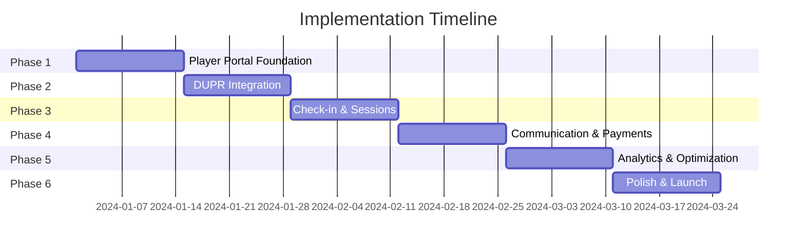

# Implementation Roadmap

## Executive Summary
This roadmap outlines the phased approach to implementing the complete Pickleball Open Play system with DUPR integration. The implementation is divided into 6 phases over 12 weeks, with clear milestones and deliverables for each phase.

## Current State Assessment

### Existing Infrastructure ✅
- PostgreSQL database with events schema
- DUPR brackets and rating fields in database
- Basic event CRUD operations in API
- Admin dashboard with calendar views
- Authentication system with player profiles
- Court management system

### Required Development 🚧
- Player-facing web interface
- DUPR API integration
- Real-time check-in system
- Match result submission
- Notification system
- Payment processing
- Mobile optimization
- Analytics and reporting

## Phase 1: Player Portal Foundation (Weeks 1-2)

### Week 1: Core Player Interface
**Objective**: Create the basic player-facing web application

#### Tasks:
1. **Set up player portal structure**
   ```
   dink-house-player/
   ├── pages/
   │   ├── events/
   │   │   ├── index.tsx (event listing)
   │   │   └── [id].tsx (event details)
   │   ├── profile/
   │   │   └── index.tsx
   │   └── auth/
   │       ├── login.tsx
   │       └── register.tsx
   ```

2. **Implement event discovery page**
   - Grid/list view toggle
   - Basic filtering (date, type, skill)
   - Event cards with key information
   - Pagination/infinite scroll

3. **Create event detail page**
   - Full event information display
   - Registration button
   - Participant count
   - Court information

#### Deliverables:
- [ ] Deployed player portal at `play.dinkhouse.com`
- [ ] Event browsing functionality
- [ ] Basic authentication flow
- [ ] Responsive design for mobile

#### Success Criteria:
- Players can view all upcoming events
- Event details are clearly displayed
- Page load time < 2 seconds

### Week 2: Registration & Profile
**Objective**: Enable online registration and profile management

#### Tasks:
1. **Registration flow implementation**
   ```javascript
   // Registration API endpoint
   POST /api/events/{id}/register
   {
     "player_id": "uuid",
     "skill_level": "3.5",
     "notes": "optional notes"
   }
   ```

2. **Player profile features**
   - View/edit personal information
   - DUPR rating display (placeholder)
   - Event history
   - Upcoming registrations

3. **Smart filtering based on skill**
   - Hide ineligible DUPR events
   - Show appropriate badges
   - Implement buffer zone logic

#### Deliverables:
- [ ] Working registration system
- [ ] Profile management page
- [ ] Smart event filtering
- [ ] Registration confirmation emails

#### Success Criteria:
- Registration completion rate > 80%
- Appropriate events shown to players
- Email delivery rate > 95%

## Phase 2: DUPR Integration (Weeks 3-4)

### Week 3: DUPR API Connection
**Objective**: Establish connection with DUPR API for rating verification

#### Tasks:
1. **OAuth2 implementation**
   ```javascript
   // DUPR Service Setup
   class DUPRService {
     - setupOAuth()
     - handleCallback()
     - refreshToken()
     - storeCredentials()
   }
   ```

2. **Player DUPR connection flow**
   - "Connect DUPR Account" button
   - OAuth redirect handling
   - Token storage
   - Initial rating fetch

3. **Rating synchronization**
   - Scheduled sync job (hourly)
   - Manual refresh option
   - Error handling
   - Rate limit management

#### Deliverables:
- [ ] DUPR OAuth integration
- [ ] Player rating import
- [ ] Automated sync system
- [ ] Error logging and monitoring

#### Success Criteria:
- 90% successful DUPR connections
- Rating sync within 1 hour
- Zero data breaches

### Week 4: Match Submission System
**Objective**: Submit match results to DUPR for rating updates

#### Tasks:
1. **Match result collection**
   ```sql
   -- Match results table
   CREATE TABLE events.match_results (
     id UUID PRIMARY KEY,
     event_id UUID,
     round_number INT,
     team1_players UUID[],
     team2_players UUID[],
     team1_score INT,
     team2_score INT,
     dupr_submitted BOOLEAN DEFAULT false
   );
   ```

2. **DUPR submission pipeline**
   - Batch processing system
   - Validation before submission
   - Retry logic for failures
   - Submission status tracking

3. **Admin submission interface**
   - Review pending submissions
   - Manual submission trigger
   - Error resolution tools
   - Submission history

#### Deliverables:
- [ ] Match result storage system
- [ ] Automated DUPR submission
- [ ] Admin review interface
- [ ] Submission monitoring dashboard

#### Success Criteria:
- 95% successful submissions
- Submission within 24 hours
- Full audit trail

## Phase 3: Check-in & Session Management (Weeks 5-6)

### Week 5: Digital Check-in System
**Objective**: Streamline the check-in process with QR codes and mobile support

#### Tasks:
1. **QR code generation**
   ```javascript
   // Generate unique QR for each registration
   function generateCheckInQR(registrationId) {
     return QRCode.toDataURL({
       data: `checkin:${registrationId}`,
       errorCorrectionLevel: 'M'
     });
   }
   ```

2. **Check-in interfaces**
   - Player mobile check-in page
   - Staff QR scanner interface
   - Manual check-in backup
   - Walk-in registration support

3. **Real-time status updates**
   - WebSocket connection
   - Live attendance dashboard
   - Court assignment display
   - Waitlist management

#### Deliverables:
- [ ] QR code system
- [ ] Mobile check-in page
- [ ] Staff check-in dashboard
- [ ] Real-time updates

#### Success Criteria:
- Check-in time < 30 seconds
- QR scan success rate > 95%
- Zero duplicate check-ins

### Week 6: Session Management Tools
**Objective**: Provide comprehensive tools for managing live sessions

#### Tasks:
1. **Round rotation system**
   ```javascript
   // Rotation manager
   class RotationManager {
     - generateRotations()
     - announceNextRound()
     - updateCourtAssignments()
     - handleLateArrivals()
   }
   ```

2. **Score management**
   - Digital scorecards
   - Quick entry interface
   - Validation rules
   - Leaderboard generation

3. **Session control panel**
   - Start/pause/end session
   - Timer management
   - Emergency announcements
   - Player substitutions

#### Deliverables:
- [ ] Rotation algorithm
- [ ] Score entry system
- [ ] Session control dashboard
- [ ] Timer and announcement system

#### Success Criteria:
- Rotation generation < 5 seconds
- Score entry accuracy > 98%
- Zero scheduling conflicts

## Phase 4: Communication & Payments (Weeks 7-8)

### Week 7: Notification System
**Objective**: Implement comprehensive communication system

#### Tasks:
1. **Email notification service**
   ```javascript
   // Notification templates
   const templates = {
     registration_confirmation: {},
     event_reminder_48h: {},
     event_reminder_2h: {},
     check_in_open: {},
     rating_update: {},
     event_cancelled: {}
   };
   ```

2. **SMS integration (Twilio)**
   - Phone number verification
   - SMS templates
   - Opt-in/opt-out management
   - Delivery tracking

3. **In-app notifications**
   - Push notification setup
   - Notification preferences
   - Read/unread tracking
   - Notification center

#### Deliverables:
- [ ] Email service integration
- [ ] SMS capability
- [ ] Push notifications
- [ ] Preference management

#### Success Criteria:
- Email delivery > 95%
- SMS delivery > 90%
- Notification opt-in > 60%

### Week 8: Payment Processing
**Objective**: Enable online payment for event registration

#### Tasks:
1. **Payment gateway integration**
   ```javascript
   // Stripe integration
   const stripe = require('stripe')(STRIPE_KEY);

   async function processPayment(amount, token) {
     return stripe.charges.create({
       amount: amount * 100,
       currency: 'usd',
       source: token,
       description: 'Event registration'
     });
   }
   ```

2. **Payment flow implementation**
   - Secure checkout page
   - Multiple payment methods
   - Refund processing
   - Receipt generation

3. **Financial reporting**
   - Daily transaction reports
   - Revenue analytics
   - Refund tracking
   - Reconciliation tools

#### Deliverables:
- [ ] Stripe/Square integration
- [ ] Secure payment flow
- [ ] Refund system
- [ ] Financial dashboards

#### Success Criteria:
- Payment success rate > 95%
- PCI compliance achieved
- Transaction time < 3 seconds

## Phase 5: Analytics & Optimization (Weeks 9-10)

### Week 9: Analytics Implementation
**Objective**: Provide comprehensive analytics for business insights

#### Tasks:
1. **Data collection setup**
   ```sql
   -- Analytics events table
   CREATE TABLE analytics.events (
     id UUID PRIMARY KEY,
     event_type VARCHAR(100),
     user_id UUID,
     session_id VARCHAR(255),
     properties JSONB,
     created_at TIMESTAMPTZ
   );
   ```

2. **Dashboard creation**
   - Event performance metrics
   - Player engagement tracking
   - Revenue analytics
   - Court utilization reports

3. **Custom reports**
   - Player retention analysis
   - Popular time slots
   - Skill distribution
   - DUPR rating trends

#### Deliverables:
- [ ] Analytics database schema
- [ ] Admin analytics dashboard
- [ ] Export functionality
- [ ] Automated reports

#### Success Criteria:
- Data accuracy > 99%
- Report generation < 10 seconds
- Historical data retained

### Week 10: Performance Optimization
**Objective**: Optimize system performance and user experience

#### Tasks:
1. **Frontend optimization**
   - Code splitting
   - Image optimization
   - Caching strategies
   - PWA implementation

2. **Backend optimization**
   - Query optimization
   - Connection pooling
   - Response caching
   - Load balancing setup

3. **Database optimization**
   - Index optimization
   - Query performance tuning
   - Archival strategies
   - Backup automation

#### Deliverables:
- [ ] Performance improvements
- [ ] PWA functionality
- [ ] Optimized database
- [ ] Load testing results

#### Success Criteria:
- Page load < 1.5 seconds
- API response < 200ms
- 99.9% uptime

## Phase 6: Polish & Launch (Weeks 11-12)

### Week 11: Testing & Bug Fixes
**Objective**: Comprehensive testing and issue resolution

#### Tasks:
1. **Testing suite completion**
   ```javascript
   // Test coverage targets
   const coverage = {
     unit_tests: 80,
     integration_tests: 70,
     e2e_tests: 60,
     api_tests: 90
   };
   ```

2. **User acceptance testing**
   - Beta user program
   - Feedback collection
   - Issue prioritization
   - Bug fixes

3. **Security audit**
   - Penetration testing
   - Vulnerability scanning
   - Access control review
   - Data encryption verification

#### Deliverables:
- [ ] Complete test suite
- [ ] Beta feedback report
- [ ] Security audit results
- [ ] Bug fix deployment

#### Success Criteria:
- Test coverage > targets
- Critical bugs = 0
- Security vulnerabilities = 0

### Week 12: Production Launch
**Objective**: Successfully launch the complete system

#### Tasks:
1. **Production deployment**
   - Infrastructure setup
   - SSL certificates
   - DNS configuration
   - Monitoring setup

2. **Launch preparation**
   - Staff training
   - Documentation completion
   - Support procedures
   - Marketing materials

3. **Go-live execution**
   - Phased rollout plan
   - Monitoring and support
   - Issue tracking
   - Success metrics

#### Deliverables:
- [ ] Production environment
- [ ] Complete documentation
- [ ] Trained staff
- [ ] Launch announcement

#### Success Criteria:
- Successful production deployment
- Zero critical issues in first 48 hours
- 100+ registrations in first week

## Resource Requirements

### Development Team
- **Frontend Developer** (2): Player portal and admin enhancements
- **Backend Developer** (2): API and integrations
- **DevOps Engineer** (1): Infrastructure and deployment
- **QA Engineer** (1): Testing and quality assurance
- **Project Manager** (1): Coordination and tracking

### Infrastructure
```yaml
Production:
  - Web Servers: 2x (load balanced)
  - Database: PostgreSQL (primary + replica)
  - Cache: Redis cluster
  - Storage: S3-compatible
  - CDN: CloudFlare

Staging:
  - Web Server: 1x
  - Database: PostgreSQL
  - Cache: Redis
  - Storage: Local

Development:
  - Local development environments
  - Shared development database
  - CI/CD pipeline
```

### Third-Party Services
- **DUPR API**: Rating verification and submission
- **Stripe/Square**: Payment processing
- **SendGrid/AWS SES**: Email delivery
- **Twilio**: SMS notifications
- **Cloudflare**: CDN and DDoS protection
- **Sentry**: Error monitoring
- **DataDog**: Performance monitoring

## Risk Management

### Identified Risks
1. **DUPR API Changes**
   - Mitigation: Regular API monitoring, versioning strategy
   - Contingency: Manual rating entry fallback

2. **Payment Processing Issues**
   - Mitigation: Multiple payment providers
   - Contingency: Cash payment option

3. **Scalability Concerns**
   - Mitigation: Load testing, auto-scaling
   - Contingency: Queue system for peak times

4. **Data Security Breach**
   - Mitigation: Encryption, regular audits
   - Contingency: Incident response plan

5. **User Adoption**
   - Mitigation: Beta testing, training programs
   - Contingency: Phased rollout, feedback loops

## Success Metrics

### Phase 1-2 (Weeks 1-4)
- Player registrations: 100+
- DUPR connections: 50+
- System uptime: 99%

### Phase 3-4 (Weeks 5-8)
- Check-in time: < 30 seconds
- Payment success: > 95%
- Email delivery: > 95%

### Phase 5-6 (Weeks 9-12)
- Page load time: < 1.5 seconds
- User satisfaction: > 4.5/5
- Revenue increase: 20%

### Post-Launch (Month 1)
- Active users: 500+
- Events per week: 20+
- Player retention: > 60%

## Budget Estimate

### Development Costs
```
Personnel (12 weeks):
- Developers (4): $120,000
- DevOps (1): $30,000
- QA (1): $25,000
- PM (1): $30,000
Total: $205,000

Infrastructure (Annual):
- Hosting: $12,000
- Services: $8,000
- Licenses: $5,000
Total: $25,000

Third-Party Services (Annual):
- DUPR API: $6,000
- Payment Processing: 2.9% + $0.30/transaction
- Email/SMS: $3,000
- Monitoring: $2,000
Total: $11,000 + transaction fees

Total Year 1: $241,000 + transaction fees
```

## Timeline Summary



## Next Steps

### Immediate Actions (Week 0)
1. **Team Assembly**: Recruit and onboard development team
2. **Environment Setup**: Configure development and staging environments
3. **API Access**: Obtain DUPR API credentials
4. **Service Accounts**: Set up third-party service accounts
5. **Project Kickoff**: Align team on roadmap and objectives

### Weekly Checkpoints
- Monday: Sprint planning and task assignment
- Wednesday: Mid-sprint check-in
- Friday: Sprint review and demo
- Ongoing: Daily standups

### Communication Plan
- Weekly stakeholder updates
- Bi-weekly steering committee meetings
- Monthly board presentations
- Real-time Slack/Teams channel

## Conclusion

This comprehensive roadmap provides a clear path to implementing a world-class pickleball open play management system. With proper execution of each phase, the Dink House will have a competitive advantage in the market with seamless DUPR integration, exceptional user experience, and robust operational tools.

The phased approach allows for iterative development, continuous feedback, and risk mitigation while maintaining aggressive timelines. Success depends on strong project management, clear communication, and commitment to quality at each phase.

Upon completion, the Dink House will offer the most advanced open play management system in the pickleball industry, setting new standards for player experience and operational efficiency.